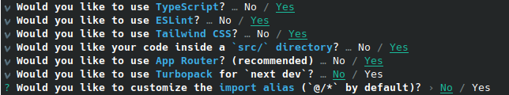
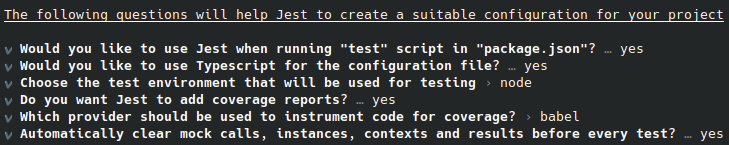

# 📦 Installation & Setup

## 1. Introduction

This guide outlines the steps required to set up the development environment for a React application using Node.js.

It covers the initial configuration of the project, the integration of Tailwind CSS for modern styling, and the setup of testing tools including Jest and Playwright to support automated unit and end-to-end testing.

The goal is to establish a robust and maintainable environment ready for further development

## 2. Prerequisites

Before starting, ensure you have the following installed:

* **Node.js**
* **npm** (included with Node.js)
* A code editor such as **Visual Studio Code**

(Optional but recommended):

* **Git** for version control
* VS Code extensions: ESLint, Prettier, Tailwind CSS IntelliSense

## 3. Project Initialization

Create project: `> npx create-next-app@latest ui`.
   

## 4. Jest Setup

1. Move to the project folder: `> cd ./ui`.
2. Install jest(for testing): `> npm install -D jest jest-environment-jsdom @testing-library/react @testing-library/dom @testing-library/jest-dom ts-node @types/jest`.
3. Configure jest:
   1. Default: `>npm init jest@latest`.
      
   2. Update files:

      ```typescript
      /*----jest.config.ts----*/

      import type { Config } from 'jest'
      import nextJest from 'next/jest.js'
       
      const createJestConfig = nextJest({
        // Provide the path to your Next.js app to load next.config.js and .env files in your test environment
        dir: './',
      })
       
      // Add any custom config to be passed to Jest
      const config: Config = {
        coverageProvider: 'v8',
        testEnvironment: 'jsdom',
        // Add more setup options before each test is run
        // setupFilesAfterEnv: ['<rootDir>/jest.setup.ts'],
        setupFilesAfterEnv: ['<rootDir>/jest.setup.ts'],
        testPathIgnorePatterns: [
          '/node_modules/',
          '/__e3e_tests__/', // adjust folder name if needed
        ],
      }
       
      // createJestConfig is exported this way to ensure that next/jest can load the Next.js config which is async
      export default createJestConfig(config)
      ```

      ```typescript
      /*----jest.setup.ts----*/
      import '@testing-library/jest-dom'
      ```

      ```typescript
      /*----tsconfig.json----*/

        {
        "compilerOptions": {
            "target": "ES2017",
            "lib": ["dom", "dom.iterable", "esnext"],
            "allowJs": true,
            "skipLibCheck": true,
            "strict": true,
            "noEmit": true,
            "esModuleInterop": true,
            "module": "esnext",
            "moduleResolution": "bundler",
            "resolveJsonModule": true,
            "isolatedModules": true,
            "jsx": "preserve",
            "incremental": true,
            "plugins": [
            {
                "name": "next"
            }
            ],
            "types": ["@testing-library/jest-dom"],
            "paths": {
            "@/*": ["./src/*"]
            }
        },
        "include": ["next-env.d.ts", "**/*.ts", "**/*.tsx", ".next/types/**/*.ts"],
        "exclude": ["node_modules"]
        }
      ```

## 5. Playwright Setup

Configure :

1. `> npm init playwright`.
   // screen shout of the configurations

## 6. Running

`> npm run dev`

`>  npx playwright test`

`>  npx playwright show-report`

`> npm test`
